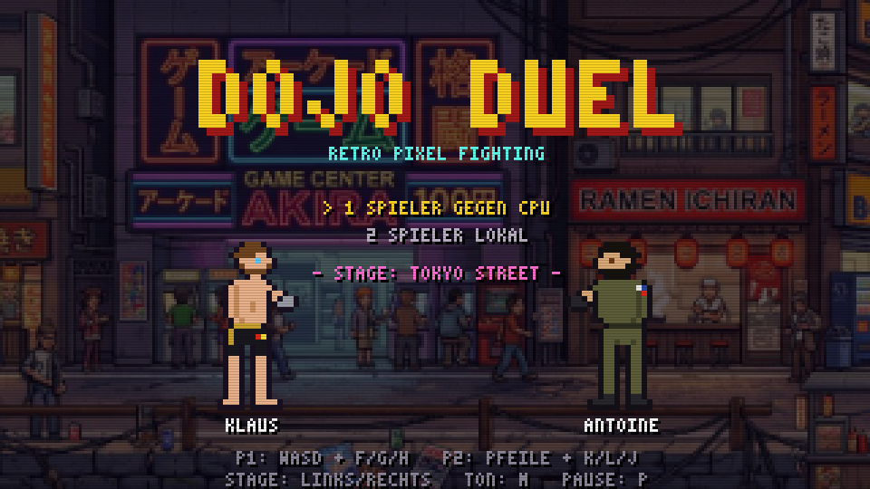
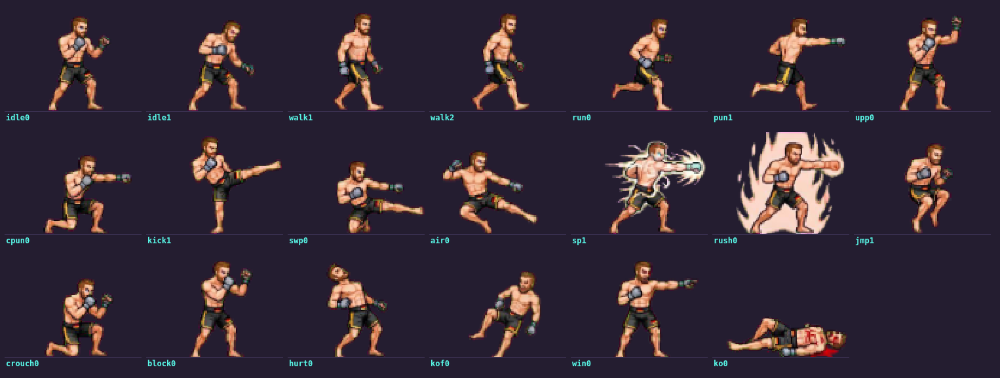
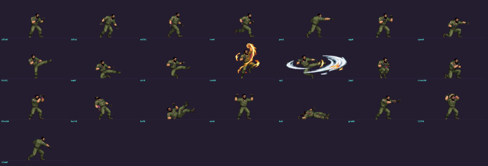
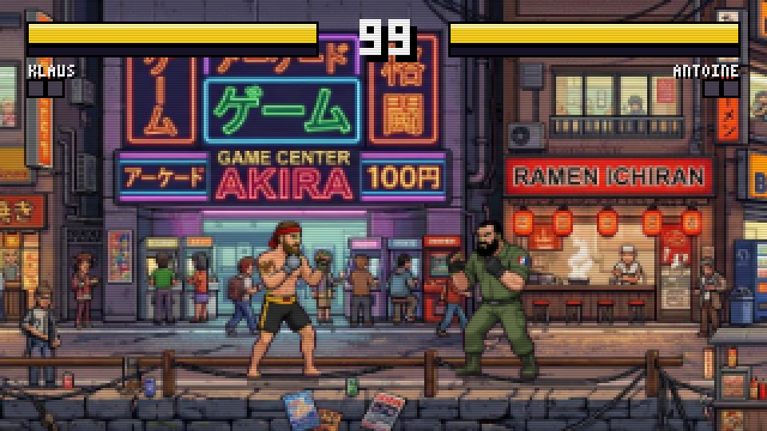
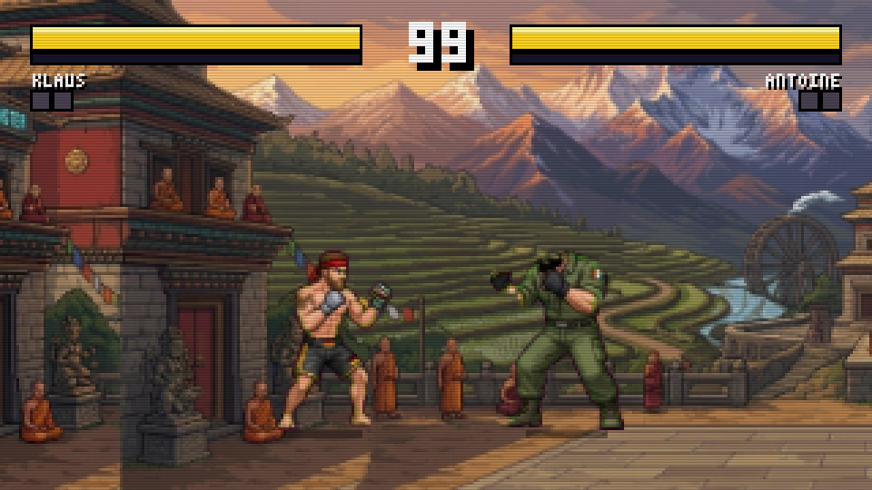
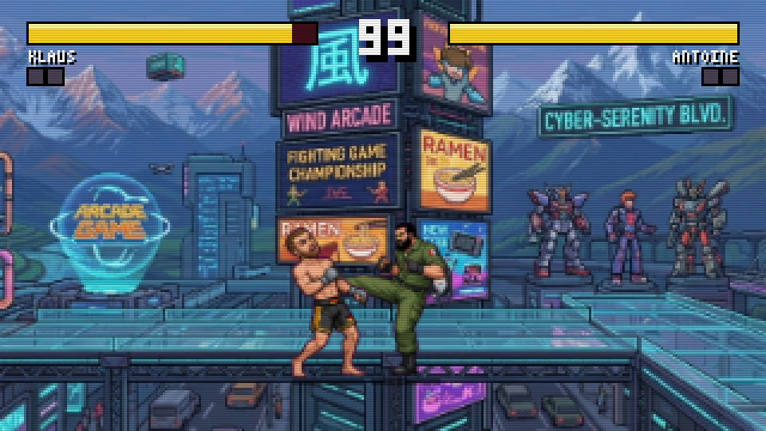

# DOJO DUEL

A retro pixel fighting game in the spirit of the early 90s — pure vanilla
JavaScript, no engine, no build step, no external assets. Open `index.html`
in a browser and fight.



## Play

**Easiest way:** double-click `index.html` — it runs straight in the browser.

Or with a local server (recommended if your browser blocks local files and
you use custom stage images in `assets/`):

```bash
cd dojo-duel
python3 -m http.server 8000
# then open http://localhost:8000
```

## Controls

| Action     | Player 1 | Player 2 |
| ---------- | -------- | -------- |
| Move       | A / D    | ← / →    |
| Jump       | W        | ↑        |
| Crouch     | S        | ↓        |
| Punch      | F        | K        |
| Kick       | G        | L        |
| Special    | H        | J        |
| **Block**  | *hold back while the opponent attacks* | same |

Jump + kick = flying kick. Chip damage on block is in, but (unlike the
big classics) it cannot score a K.O.

**Menu / general:** Enter = start/confirm · ↑↓ = pick mode ·
←→ = pick stage · P = pause · M = sound on/off

## What's already in

- **The roster** (based on the project owner's character reference sheets,
  built with a hybrid workflow — reference sheet in, grid sprite out):
  - **KLAUS VÖLKER** (MMA, Germany): bare torso with anatomy shading,
    black-and-gold trunks with a flag patch, MMA gloves, chest tattoo —
    and heterochromia, one blue eye and one brown one, so which color you
    see depends on which way he faces.
    
  - **ANTOINE MOREAU** (judo/GIGN, France): a head taller and visibly
    heavier, olive uniform with rolled-up sleeves and chest pockets,
    French flag patch on the shoulder, fingerless gloves, heavy boots,
    full beard and the scar across his brow. His special hurls a
    **grenade**.
    
  - **HANZO**, the karate fighter from the first prototype, remains as a
    bonus set (roster mapping is configurable in `js/constants.js`)
- **Single-player vs CPU** (the AI keeps its distance, blocks, dodges
  projectiles — and is deliberately beatable) plus **local two-player
  mode** on one keyboard
- **3 scrolling stages** based on the project owner's reference panoramas:
  640px arenas, a camera that follows the fighters, and real parallax
  layers (far/mid/near plus foreground silhouettes passing IN FRONT of
  the fighters), all with animated details:

  | Stage | Homage | Animations |
  | ----- | ------ | ---------- |
  | TOKYO STREET | evening shopping street | passing train, cheering crowd, neon flicker, tower beacon |
  | NEON CROSSING | cyberpunk boulevard | traffic below the glass floor, monorail, drone, pulsing billboards, mech eyes |
  | WIND TEMPLE | mountain monastery | fluttering prayer flags, incense, swaying monks |

- Health bars with red damage trails, a 99-second timer, best-of-3
  rounds, K.O. and time-over logic, victory pose
- Hit sparks, hitstop (a brief freeze on impact), screen shake on K.O. —
  the small things that make it feel "arcade"
- Synthesized chiptune sound effects (WebAudio, no audio files)
- A custom 3x5 pixel font, CRT scanline effect (removable in `style.css`)





## Bring your own art

Both the stages **and the fighters** can be replaced by your own images —
drop a PNG into `assets/`, reload, done. For a fighter, that is one sheet
with the poses side by side on a flat background; the importer slices it,
keys out the background, lines the poses up on their feet and scales them
to fighter height. A partial sheet is fine: unlisted poses keep the
generated art. Pose order, the exact image requirements and a ready-made
generator prompt are in [`assets/README.md`](assets/README.md).

The fighters that ship with the repo are **placeholders** produced by
`tools/rig.py`. They are meant to be replaced by real artwork.

## Custom stage panoramas

The three stages are drawn procedurally in code — meant as placeholders
for the original panoramas: drop them in as `assets/stage-1.png` through
`stage-3.png` and they are automatically used as a **scrolling world**
(scaled to 180px height, world width up to 832px from the image width).
Details and upload guide: [`assets/README.md`](assets/README.md).

## Project structure

| File | Job |
| ---- | --- |
| `js/constants.js` | All tuning knobs: physics, attack frame data, damage, roster |
| `js/sprites.js` | **The pixel art.** Every frame is a text grid, every character a pixel |
| `js/spritesheet.js` | Imports hand-made fighter sprite sheets from `assets/` |
| `tools/rig.py` | Skeleton rig that generates the placeholder fighter frames |
| `js/font.js` | 3x5 pixel font |
| `js/stage.js` | The three procedural stages + panorama pipeline |
| `js/fighter.js` | Fighter state machine, hitboxes, hit logic, animation resolve |
| `js/ai.js` | CPU opponent |
| `js/game.js` | Round flow, camera, collisions, projectiles, particles |
| `js/input.js` | Keyboard (physical keys, QWERTZ-safe) |
| `js/audio.js` | Synthesized sound effects |
| `js/ui.js` | HUD, title screen, announcements |
| `js/main.js` | Fixed-step 60fps loop |

### How the fighters are drawn

Every sprite frame is a text grid — one character per pixel:

```text
'.............KJHSSWESSAK..................',   ← face with eye
'.............KJHSJJJJJSK..................',   ← beard texture
```

`K` = outline, `S` = skin, `A/T/U` = skin light/shadow/deep, `H` = hair,
`D/G/g` = cloth, and so on (full legend at the top of `js/sprites.js`).

Klaus's and Antoine's grids are **generated by `tools/rig.py`** rather
than typed by hand. A pose there is a set of joint positions — shoulder,
elbow, hip, knee — and the rig rasterizes limbs as tapered capsules with
cylindrical shading, the torso as a width profile with a real waist, and
stamps every body part with its own outline so the silhouette stays
readable. Hand-typing those rows is what made the first attempt look
lumpy; moving joints does not.

```bash
python3 tools/rig.py             # rewrite the generated grids in sprites.js
python3 tools/rig.py --preview   # plus contact sheets in dist/
```

Adding a pose means adding a joint dictionary to `POSES` in the rig. You
can still edit the grids by hand — just note the next rig run overwrites
them. Hanzo's bonus set is hand-drawn and untouched by the generator, and
each character's second color scheme is a palette swap in `sprites.js`.

### Balancing

All attacks live as frame data in `js/constants.js`:

```js
punch: { startup: 5, active: 4, recovery: 10, dmg: 6, ... }
```

`startup` = wind-up frames, `active` = hit-window frames, `recovery` =
cool-down frames (at 60 frames per second). Turn these knobs to balance
the game.

## Single-file build

```bash
node tools/build-single.mjs           # game only
node tools/build-single.mjs --embed   # game + stage panoramas inlined
```

produces `dist/dojo-duel.html` — the whole game in one file, handy for
sharing or uploading (e.g. itch.io).

## Tests

An automated smoke test (Playwright) boots the game headless, simulates
keyboard input and verifies hits, projectiles, jumping, K.O. and round
flow: see `tools/smoke-test.js`.

```bash
npm install playwright   # once, anywhere outside the repo is fine
node tools/smoke-test.js
```

## Roadmap

The project grows in milestones — plan, decisions and status live in
[`ROADMAP.md`](ROADMAP.md).

## Legal

Inspired by the arcade classics of the 90s, but every name, sprite, stage
and sound is an original creation of this project. No third-party
material included.
