# DOJO DUEL

A retro pixel fighting game in the spirit of the early 90s — pure vanilla
JavaScript, no engine, no build step, no dependencies. The fighters and
stages are PNGs in `assets/`; everything else is code.


## Play

```bash
cd dojo-duel
python3 -m http.server 8000
# then open http://localhost:8000
```

Double-clicking `index.html` also works and needs nothing installed, but a
browser will not let a local page read the pixels of a local image — so
the fighters fall back to the generated placeholder art and you miss half
the point. Use the server.

## Controls

| Action     | Player 1 | Player 2 |
| ---------- | -------- | -------- |
| Move       | A / D    | ← / →    |
| Jump       | W        | ↑        |
| Crouch     | S        | ↓        |
| Punch      | F        | K        |
| Kick       | G        | L        |
| Special    | H        | J        |
| **Block**  | *hold back while the opponent attacks* | same |
| **Dash**   | *tap a direction twice* | same |
| Pick fighter | A / D then F *(on the select screen)* | ← / → then K |

| Move | Input | What it does |
| ---- | ----- | ------------ |
| Straight punch | punch | fast, safe poke |
| High kick | kick | slower, hurts more |
| Crouching punch | down + punch | the fastest thing you have |
| **Sweep** | down + kick | slow, **must be blocked low**, knocks them down |
| Flying kick | jump + kick | your way in — the longer reach |
| Flying punch | jump + punch | the other way in: faster, shorter |
| Dash | tap forward or back twice | covers ground, but you cannot act during it |
| Projectile | special, or ↓ ↘ → + punch | fireball (Klaus), grenade (Antoine), molotov (Maxim) — the first two throw you **a quarter of the screen** |
| **Uppercut** | → ↓ ↘ + punch | anti-air: tall, hits hard, 26 frames of regret if it whiffs. Antoine's leaves the ground and throws you **half a screen** |
| **Rushing special** | ↓ ↘ → + kick | Klaus charges in flames, Antoine spins into a tornado kick, Maxim goes up in flames — and it throws you **the whole screen** |
| **Super** | ↓ ↘ → + special, at full meter | four hits, and nothing touches you while it starts |
| **Throw** | walk into them + punch | goes straight through a block |

The two motions are the classics: a quarter circle forward for the
projectile, the rush and the super, the dragon-punch motion for the
uppercut. They are read leniently — you have to pass through the directions
in order and inside 20 frames, not hit each one cleanly. The special button
stays as a shortcut for the projectile, so nothing is behind a motion you
cannot do.

**Cancels.** A normal that *connects* can be cancelled straight into a
special — punch, then quarter-circle kick, and the rush comes out before
they recover. That is the combo engine, and it only works on a hit: a
whiffed poke stays as punishable as it looks.

**Meter** builds from damage you deal, damage you take and chip you block,
so losing a round still charges it, and it carries between rounds. Full, it
flashes under your health bar.

**Throws** are the answer to someone who only blocks. Walk into them and
press punch: guard does not stop it, they land behind you on the floor. Out
of range the same input is just a punch. The catch is that anyone who
pressed punch in the last six frames shrugs the grab off — so mashing throw
at a mashing opponent loses, which is the point.

**The jump is a read, and the whole game hangs off it.** From about frame
13 to frame 31 of a 44-frame jump your feet are above a fireball — so
jumping a projectile is a real answer, and a badly timed one lands you
straight into it. That is what makes throwing one a question rather than
free damage: they might be over it before it arrives.

**And the answer to the jump is the uppercut.** → ↓ ↘ + punch, invulnerable
through its whole hit window, reaching exactly as far as a flying kick. Get
it out while they are coming down and it beats the jump-in clean; get it
out late and you eat the kick anyway, standing in 26 frames of recovery.
Fireball, jump, anti-air: each one beats the one before it, and that
triangle is the game.

Klaus throws his fireball flat down the whole screen — it never passes over
a crouching head, so it can only be blocked, jumped or answered with one of
your own. Antoine lobs his grenade and it goes off where it lands. Maxim's
molotov is heavier: it comes down sooner and covers less ground. Both lobs
sail over a crouch for part of their flight, which is the other reason to
duck. The same button, three different problems.

| A jump clearing a fireball | An uppercut answering the jump |
| --- | --- |
| 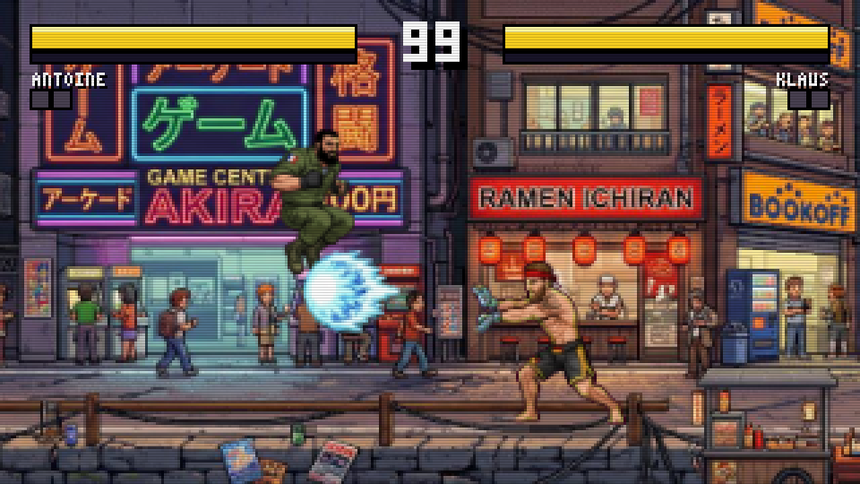 | 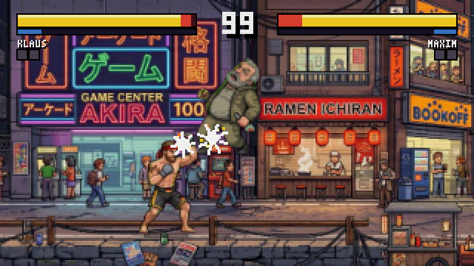 |

**A special throws you across the room.** Knockback comes in two kinds
now. A normal shoves — a horizontal nudge that decays away in a few
frames, worth about seven times itself in ground covered. A special
*throws*: off the ground on a 45-degree arc, a stated number of screen
pixels back, landing there. The screen is 320 wide, so a rushing special
sends you the whole way, Antoine's uppercut half of it, and a fireball or
a molotov a quarter. Antoine's grenade keeps the shove — it goes off at
your feet rather than hitting you like a truck.

Everything about the arc falls out of that one distance. Launch a body at
45 degrees and it covers `2v²/g`, so the distance fixes the speed, the
speed fixes the height and the height fixes the hang time: 80px lifts you
20 and puts you down in 26 frames, 320px lifts you 80 and takes 52. The
big throw looks big because it is.

A throw always knocks down, because nobody is thrown across an arena and
stays on their feet — so a fireball is a knockdown now where it used to be
hitstun. That is the trade for the distance: it buys you room rather than
pressure.

| Antoine leaves the ground with it | A rushing special, the full screen |
| --- | --- |
| 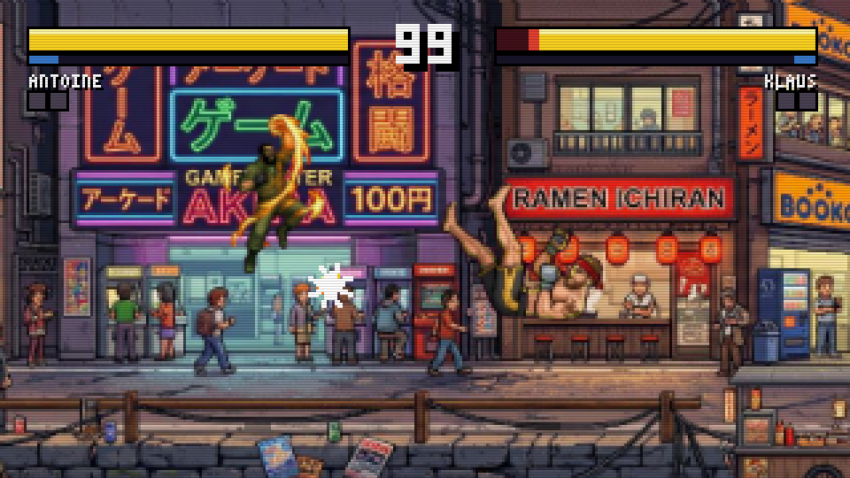 | 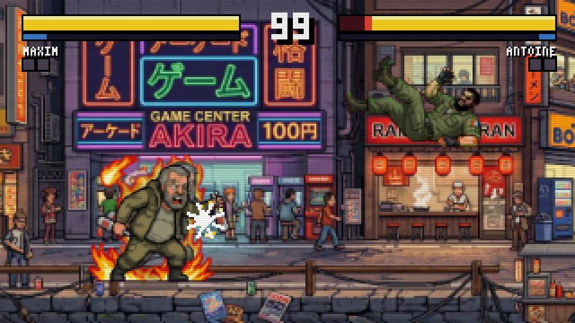 |

**The specials are drawn, not held.** Each of them used to be one pose
shown three times — an uppercut was literally a punch frame with a
different name. They now play five or six drawings apiece off two more
sheets per fighter, spread over the move's own frame data, with the
contact drawing held through the hit window. Klaus gathers a fireball and
lets it go; Antoine coils and rises through a flaming uppercut, or spins
into a tornado kick; Maxim strikes a match, lights the bottle and throws
it, or goes up in flames and charges.

| Klaus gathers a fireball | Antoine's spinning kick |
| --- | --- |
| 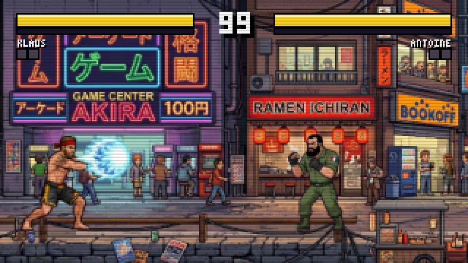 | 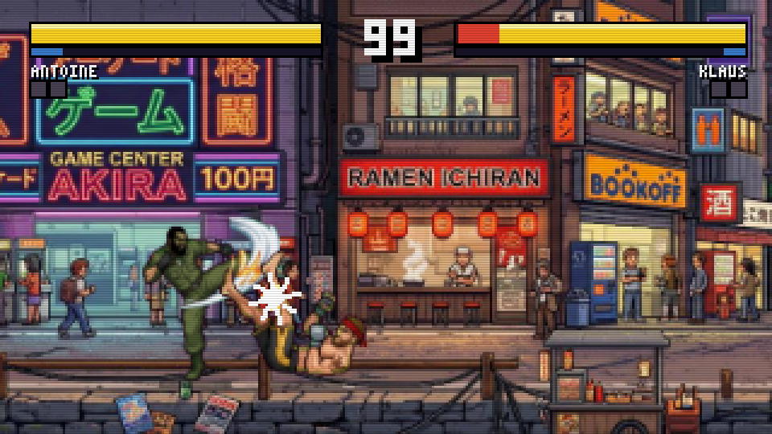 |

| Maxim lights the bottle | Maxim goes up in flames |
| --- | --- |
| 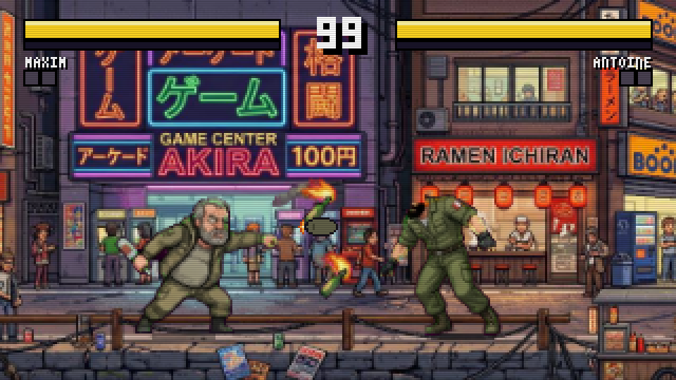 | 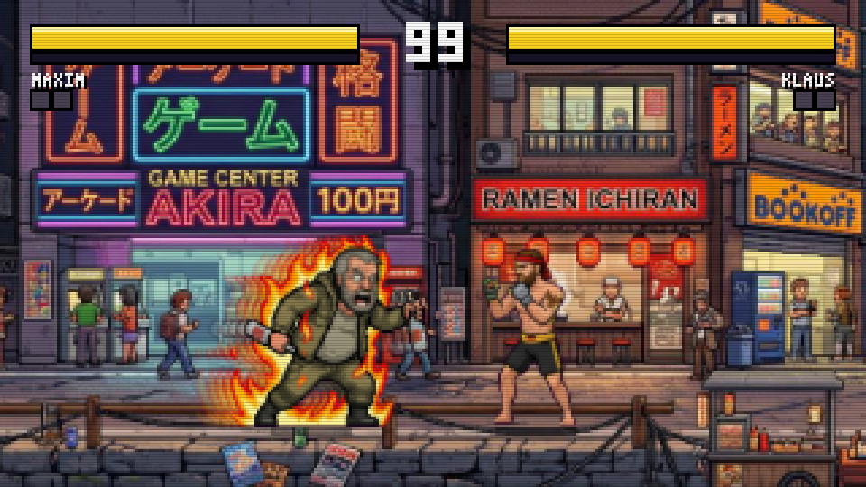 |

| Uppercut catching a jump-in | Klaus's charge |
| --- | --- |
| 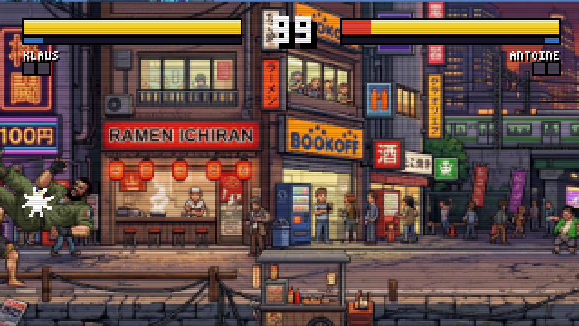 | 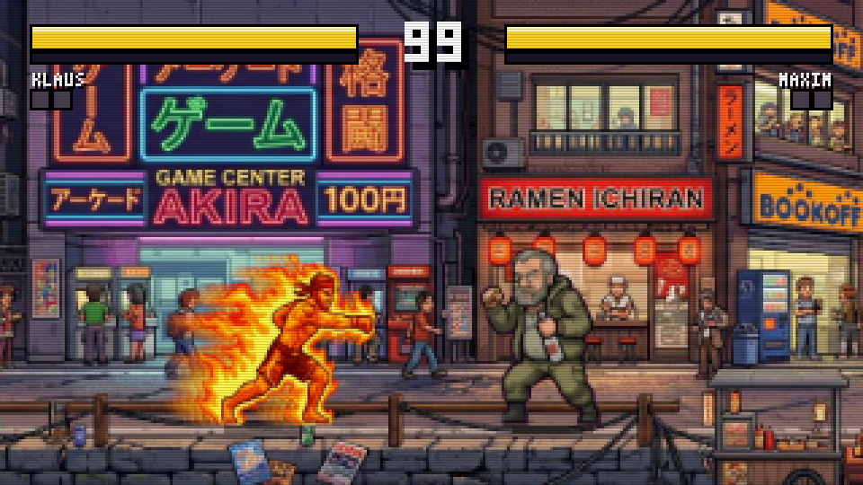 |

| The throw, grab through slam |
| --- |
| 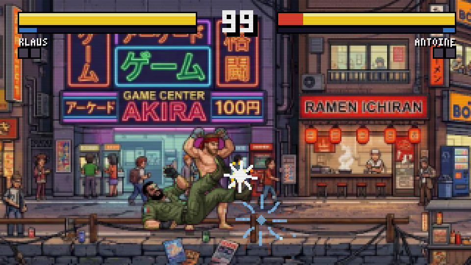 |

That sweep is the whole reason to crouch. Blocking a low while standing
does not work — hold back **and** down, or you end up on the floor. On the
way down you are untouchable, so a knockdown resets the round rather than
starting a loop.

| Standing through it | Blocking it low |
| ------------------- | --------------- |
| 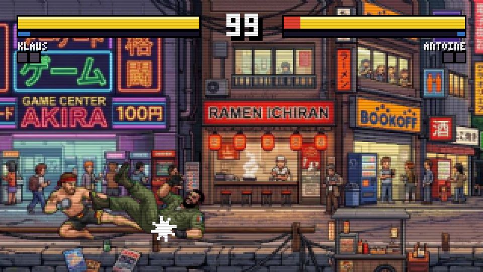 | 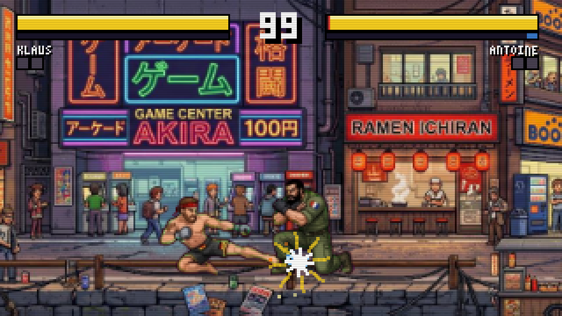 |

Chip damage on block is in, but (unlike the big classics) it cannot score
a K.O.

**Menu / general:** Enter = start/confirm · ↑↓ = pick mode ·
←→ = pick stage · Esc = back · P = pause · M = sound on/off

## What's already in

- **A character select screen.** Both sides choose at once, arcade style:
  each moves along the row with their own left/right and locks in with
  their own punch key, and the match starts when both have. Against the
  CPU only player one chooses and the machine takes somebody else, so a
  mirror match is something you ask for rather than something you get.

  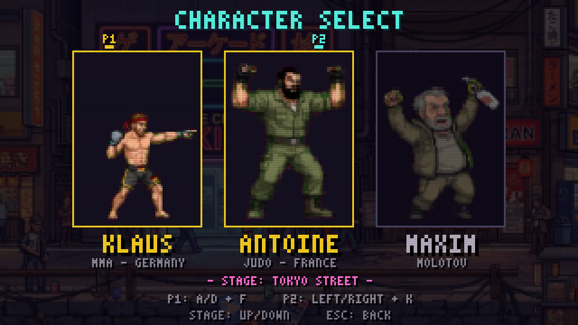

  The portraits are one image per fighter, `assets/portrait-<name>.png`,
  painted on the same flat field as the sprite sheets and keyed out the
  same way. The victory splash uses them too. Without one, a panel falls
  back to that fighter's own victory pose, so both screens work before any
  portrait art exists.
- **The roster**, drawn as sprite sheets and imported straight from
  `assets/` (see [Bring your own art](#bring-your-own-art)):
  - **KLAUS VÖLKER** (MMA, Germany): bare torso, black-and-gold trunks
    with a flag patch, MMA gloves, full beard. His special throws a
    **fireball**.
    
  - **ANTOINE MOREAU** (judo/GIGN, France): heavier, olive uniform with
    rolled-up sleeves, French flag patch on the shoulder, fingerless
    gloves, heavy boots, full beard. Drawn smaller and finer than the other
    two, which is what caught the importer out (see below). His special
    hurls a **grenade**.
    
  - **MAXIM** (the old man, and the one you underestimate): field jacket,
    grey beard, a bottle in his fist in every single pose. His special
    throws a lit **molotov**.
    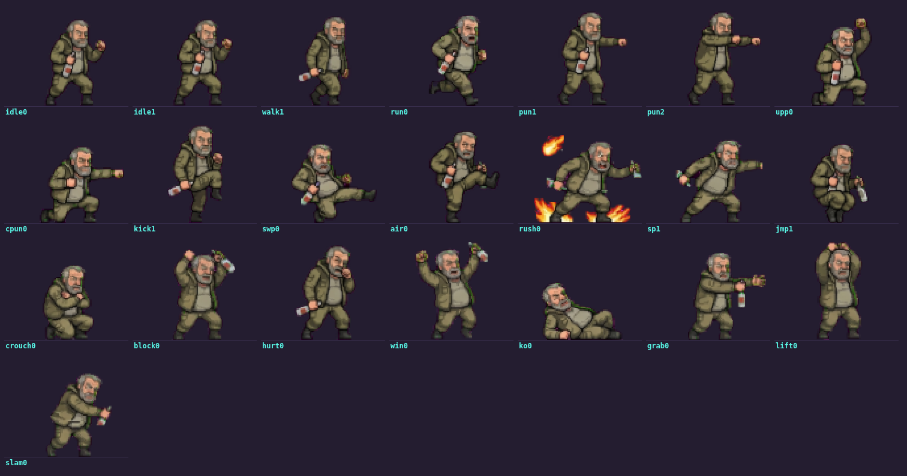
  - **HANZO**, the karate fighter from the first prototype, remains as a
    bonus set (the roster itself is a list in `js/constants.js`)

  Each sheet carries 22 to 24 poses and all of them are on screen — the
  grab, the lift and the slam included, so a throw is drawn rather than
  borrowed from another move. Klaus's sheet even carries his fireball as a
  picture of its own, and that is what the game puts in the air.
- **Animation sheets.** A pose per movement is a switch, not an animation,
  so movement comes on extra sheets, `assets/<fighter>-<move>.png`, whose
  poses beat the main sheet's. All three fighters have four: about 21
  figures covering the idle, walk, punch, kick and hit reaction, about 10
  more for the jump and both air attacks, and two more carrying a special
  apiece — the fireball, the flaming charge, the rising uppercut, the
  spinning kick, the molotov. Each brings its own timing along with its
  drawings, and an attack plays as many drawings as it has — the one the
  arm is fully out in is held through the whole hit window.

  No two came back with the same figure counts, which is what
  `SHEET_ORDER` is for: a spare guard, a second drawing of a kick already
  fully out, three hit-reaction poses on a sheet that never asked for
  them. `null` drops each of those in one line.

  Nor do they always come back in *order*. That costs nothing either: the
  order list says which figure is which pose and the animation names the
  sequence, so a sheet that draws the wind-up after the release is one
  reordered line. Two of the six special sheets needed it.

  And a strip does not have to be self-contained. The pose Antoine lands
  the spinning kick in never made it into the generation, so the recovery
  borrows `kick4` off his moves sheet — the foot coming back down after a
  high kick, which is the shape that was missing. By the time an animation
  reads a pose, every sheet a fighter owns is on the same table.
- **Single-player vs CPU**, and the three of them do not play alike. The
  AI holds a **stance** for a couple of seconds rather than rerolling a
  table of moves every few frames, which is the difference between having
  a plan and having an average. Antoine comes forward and stays there —
  his grenade dies at 107px, so he has no long game and does not pretend
  to. Klaus and Maxim will hold the gap, back-dash out of your reach and
  throw from range, and two of them at it is a corner-to-corner fireball
  war. Falling behind on health, or on the clock, pushes any of them
  forward. It is still deliberately beatable.

  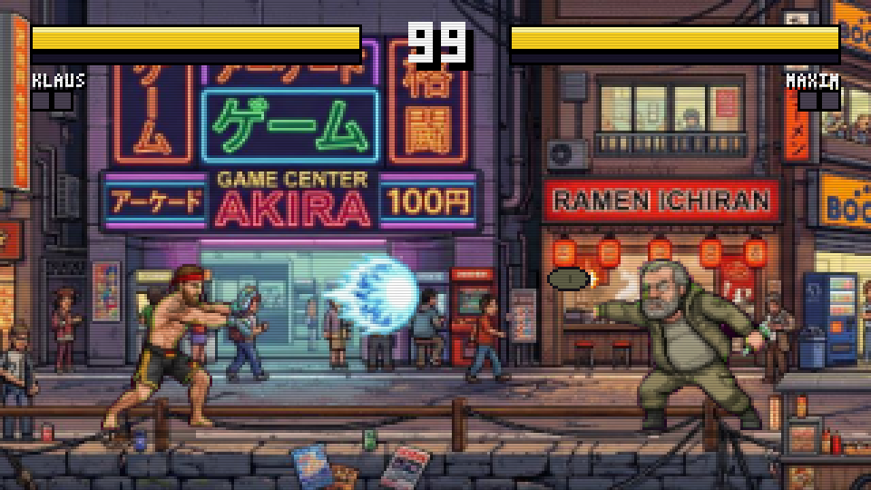

  Plus **local two-player mode** on one keyboard.
- **3 scrolling stages**, each an 832px-wide painted panorama from
  `assets/`, with a camera that follows the fighters:

  | Stage | Setting |
  | ----- | ------- |
  | TOKYO STREET | evening shopping street under the rail line |
  | WIND TEMPLE | mountain monastery |
  | NEON CROSSING | cyberpunk boulevard on a glass walkway |

  Behind each one sits a **procedural version drawn in code**, used
  whenever the panorama is missing. Those are built from real parallax
  layers (far/mid/near plus foreground silhouettes that pass IN FRONT of
  the fighters) and they animate: a train pulls in and the crowd cheers in
  Tokyo, prayer flags flutter and incense drifts at the temple, traffic
  streams below the glass floor in Neon Crossing. Delete a `stage-N.png`
  to see one.

- Health bars with red damage trails, a 99-second timer, best-of-3
  rounds, K.O. and time-over logic, victory pose
- **Impact.** Hitstop freezes the moment of contact; hit sparks are drawn
  bursts scaled by damage, with their own palette for a hit, a block and a
  super; a K.O. drops to a third speed for a moment so you get to watch it;
  dashes and rushing specials leave motion trails; landing raises dust; a
  super flashes the screen and dims the stage under the fighters. It all
  lives in `js/fx.js`, so the game loop only says what happened
- Victory splash: the winner's select-screen portrait, framed against a
  turning sunburst — or, without one, their own victory pose blown up
- **Music and sound effects.** The effects are synthesized outright — no
  audio files. So is the music, as a fallback: four tracks (one per stage,
  one for the menu) on a step sequencer, three voices reading one token
  per sixteenth off a string, which costs a few hundred bytes of pattern
  rather than a few megabytes of samples. **A real track beats it**, the
  same way a hand-drawn sheet in `assets/` beats the generated art: drop
  an audio file in `sfx/`, name it in the track table in `js/audio.js`,
  and it plays instead. Whatever has no file keeps its pattern, and so
  does the whole thing when the page is opened off disk, where a browser
  will not fetch one. The track follows the game state, and a round ends
  in silence so the K.O. and the win jingle have the room
- A custom 3x5 pixel font, CRT scanline effect (removable in `style.css`)


| Impact | A dash | Victory |
| ------ | ------ | ------- |
| 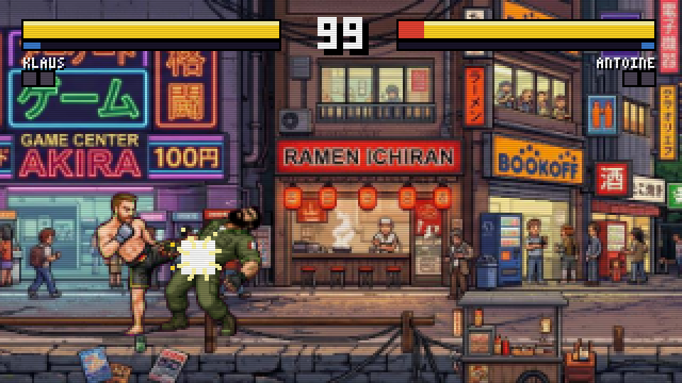 | 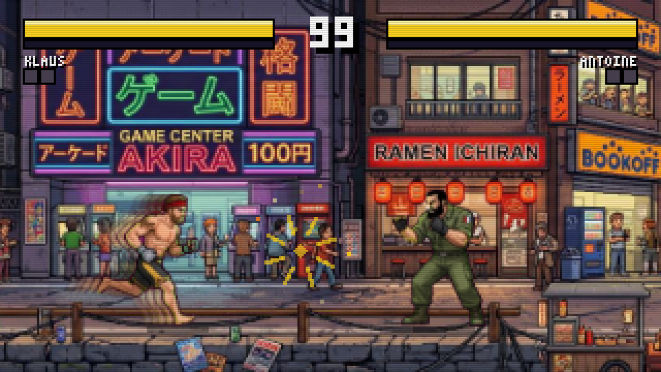 | 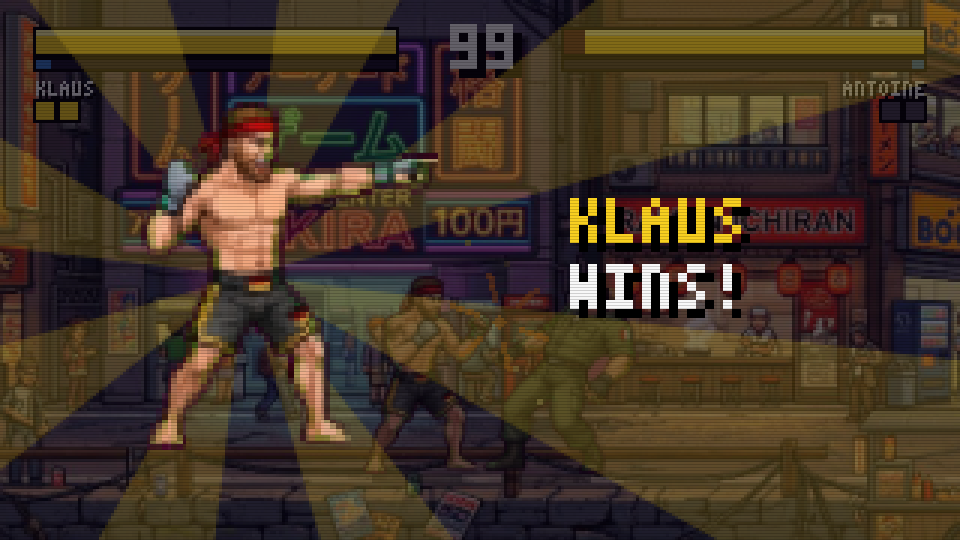 |

## Bring your own art

Every fighter and every stage in the game is a PNG in
[`assets/`](assets/README.md). Drop one in, reload, done — there is no
import step, no atlas to rebuild, no metadata file to keep in sync.

- **A stage** is one wide panorama, `stage-1.png` … `stage-3.png`. It is
  scaled once to 180px height and becomes the scrolling world (up to 832px
  wide, about 2.6 screens).
- **A fighter** is one sheet with the poses laid out next to each other on
  a flat background, `klaus.png` / `antoine.png` / `maxim.png`, plus one
  optional strip per movement, `<fighter>-<move>.png`, that gives that
  movement its in-between frames. The
  importer finds each pose as a connected shape — so the rows may even
  overlap, and a drawn grid around the poses is found and removed — keys
  the background out with a soft edge, lines every pose up on its feet and
  scales the sheet so the fighting stance comes out at the right height. A
  partial sheet is fine: whatever it leaves out keeps the generated art.

Pose order, the exact image requirements and a ready-made generator prompt
are in [`assets/README.md`](assets/README.md).

> Load the game from a local server when you use your own art. Opening
> `index.html` directly works, but a browser refuses to let the page read
> the pixels of an image loaded off disk, so the fighters silently fall
> back to the generated placeholders.

## Project structure

| File | Job |
| ---- | --- |
| `js/constants.js` | All tuning knobs: physics, attack frame data, damage, the roster |
| `js/spritesheet.js` | **The fighters.** Imports the sprite sheets from `assets/` |
| `js/portraits.js` | Select-screen faces, split out of `assets/portraits.png` |
| `js/sprites.js` | Fallback pixel art: every frame a text grid, every character a pixel |
| `tools/rig.py` | Skeleton rig that generates those fallback frames |
| `js/font.js` | 3x5 pixel font |
| `js/stage.js` | The three procedural stages + panorama pipeline |
| `js/fighter.js` | Fighter state machine, hitboxes, hit logic, animation resolve |
| `js/ai.js` | CPU opponent (blocks lows low, sweeps, dashes in) |
| `js/fx.js` | Impact: bursts, dust, trails, flashes |
| `js/game.js` | Round flow, camera, collisions, projectiles, particles |
| `js/input.js` | Keyboard (physical keys, QWERTZ-safe) |
| `js/audio.js` | Synthesized effects, the music sequencer, and the `sfx/` player |
| `js/ui.js` | HUD, title screen, announcements |
| `js/main.js` | Fixed-step 60fps loop |

### How the fighters are drawn

Two ways, and the game does not care which a frame came from.

**Imported from a sheet** — what the whole roster uses. `js/spritesheet.js`
labels the connected regions of `assets/<fighter>.png`, so a pose is found
as a shape rather than by cutting the image into strips; that is what lets
the sheets have several rows and lets those rows overlap. Each pose is then
cut out with only its own pixels, matted (see below), aligned on the middle
of its feet and scaled by one factor shared across the sheet, so a crouch
stays shorter than a stance. The reference for that factor is the fighting
stance, not the tallest frame — a special wrapped in flames is far taller
than the fighter, and measuring against it would shrink everybody.

Keying the background is the part that decides whether the result looks
bought or homemade, and it is three problems, not one.

*The soft edge.* A yes/no test on "is this pixel magenta" leaves a colored
rim wherever the art fades into the background. Instead each pixel within a
few steps of the background gets a **fractional** alpha, measured against
the solid artwork right next to it, and the key color is then mixed back
out of what survives — so a soft edge stays soft, and a black boot next to
magenta comes out black rather than purple.

*The grid.* Generators like to draw a frame around each pose, and a line
that touches two poses would fuse them into one region. A drawn line gives
itself away twice over: it vanishes when you erase everything thinner than
a limb, and it floats free of any body. Both tests together separate it
from the gold trim on a pair of trunks, which is every bit as thin but
never floats. Where a line was drawn *across* a figure, the slit it leaves
is painted over from the artwork on either side.

*"Thinner than a limb" is not a fixed number.* Generators do not all draw
at the same size, and "erase everything thinner than a limb" needs to know
how thick this sheet's limbs are. An erase wide enough to dissolve a 2px
box on a sheet drawn large also dissolves a head on a sheet drawn small —
and a dissolved head floats free of the shoulders exactly like a box edge
floats free of everything, so it is condemned and the fighter imports
decapitated. Antoine's sheet is drawn about half as thick as the other
two, and that is precisely what happened to him. The threshold is measured
per sheet now: the radius at which half the artwork has eroded away, which
tracks limb thickness and ignores everything else.

*The background is not one color.* The field itself is read as the most
common color in the sheet rather than off the corners, because a grid
drawn to the image edge puts its own color in every corner.

**Generated in code** — the fallback for a fighter with no sheet, and
Hanzo's whole bonus set. Every frame is a text grid, one character per
pixel:

```text
'.............KJHSSWESSAK..................',   ← face with eye
'.............KJHSJJJJJSK..................',   ← beard texture
```

`K` = outline, `S` = skin, `A/T/U` = skin light/shadow/deep, `H` = hair,
`D/G/g` = cloth, and so on (full legend at the top of `js/sprites.js`).
Those grids are themselves written by `tools/rig.py`: a pose there is a set
of joint positions — shoulder, elbow, hip, knee — and the rig rasterizes
limbs as tapered capsules with cylindrical shading, the torso as a width
profile with a real waist, and stamps every part with its own outline so
the silhouette stays readable.

```bash
python3 tools/rig.py             # rewrite the generated grids in sprites.js
python3 tools/rig.py --preview   # plus contact sheets in dist/
```

Adding a pose means adding a joint dictionary to `POSES` in the rig. You
can still edit the grids by hand — just note the next rig run overwrites
them. Each character's second color scheme is a palette swap in
`sprites.js`, and it applies to the generated art only: an imported sheet
brings its own colors.

### Balancing

All attacks live as frame data in `js/constants.js`:

```js
punch: { startup: 5, active: 4, recovery: 10, dmg: 6, ... }
```

`startup` = wind-up frames, `active` = hit-window frames, `recovery` =
cool-down frames (at 60 frames per second). Turn these knobs to balance
the game.

## Single-file build

```bash
node tools/build-single.mjs           # game only, ~250 KB
node tools/build-single.mjs --embed   # + every PNG in assets/ inlined
```

produces `dist/dojo-duel.html` — the whole game in one file, handy for
sharing or uploading (e.g. itch.io). `--embed` is the version that runs
anywhere, straight off disk, with the real art; it inlines every PNG in
`assets/`, so it weighs as much as that art does (~17 MB today, more than
half of it panoramas nobody will ever see at more than 832×180). Shrink
the PNGs in `assets/` first if the file has to travel.

## Tests

An automated smoke test (Playwright) boots the game headless, simulates
keyboard input and verifies hits, projectiles, jumping, K.O. and round
flow: see `tools/smoke-test.js`.

Pass a URL to test a served copy — that run also covers the sprite sheet
import, which a page opened off disk cannot do:

```bash
npm install playwright                            # once, anywhere
node tools/smoke-test.js                          # straight off disk
node tools/smoke-test.js http://localhost:8000/   # served, with the real art
```

`tools/moves-test.js` is the second suite. It drives the fighters' state
machine with scripted pads instead of keystrokes, so it can assert the
rules directly — that a sweep knocks down, that a standing block loses to
a low and a crouching one does not, that a downed fighter cannot be hit,
that a dash outruns a walk, and that every frame an animation asks for
actually exists.

It also holds down the numbers the fight is balanced on, because those are
the ones that break quietly. A jump has to clear a fireball **and not for
its whole length**; an uppercut has to reach as far as a flying kick and
beat a jump-in clean when it is timed right and lose when it is late; a
lob has to pass over a crouch and a flat fireball must never; the three
CPUs have to hold visibly different distances. Every one of those was
wrong at some point and none of it showed up as a bug report — it showed
up as "jumping feels pointless", which is a much harder thing to find.

```bash
node tools/moves-test.js
```

`tools/sheet-test.js` is the third. It covers the art import: that every
pose a `SHEET_ORDER` lists is actually found, that drawn frame lines and
drawn ground rules are recognised, that a light background works as well as
a dark one, and that keying still works when the background color also
appears inside the drawing — a patch of it walled in by artwork stays, one
open to the outside goes. It needs a served copy.

```bash
node tools/sheet-test.js http://localhost:8000/
```

## Roadmap

The project grows in milestones — plan, decisions and status live in
[`ROADMAP.md`](ROADMAP.md).

## Legal

Inspired by the arcade classics of the 90s, but every name, sprite, stage
and sound is an original creation of this project. No third-party
material included.
